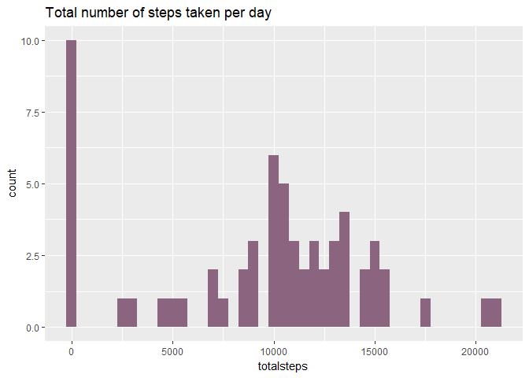
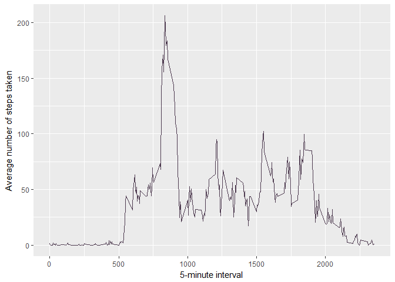
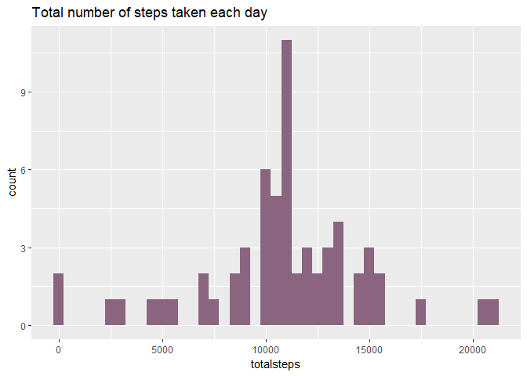
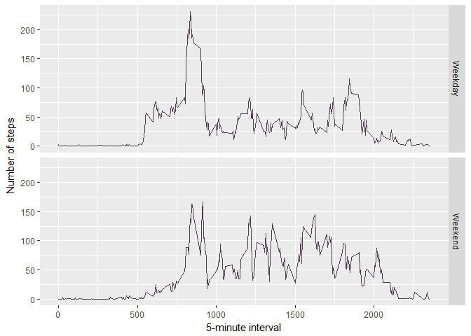

## Loading and preprocessing the data

First, let's unzip and load the activity file.


```r
unzip(zipfile="activity.zip")
data <- read.csv("activity.csv")
```


## What is mean total number of steps taken per day?

Let's plot a histogram of the total number of steps per day. This is the sum of the steps grouped by date without NA values. We also calculate the mean and the median number of steps taken per day.


```r
library(ggplot2)
totalsteps <- tapply(data$steps, data$date, FUN=sum, na.rm=TRUE)
qplot(totalsteps, binwidth=500, main="Total number of steps taken per day", fill=I("#8B657F"))
```

<!-- -->

```r
mean(totalsteps, na.rm=TRUE)
```

```
## [1] 9354.23
```

```r
median(totalsteps, na.rm=TRUE)
```

```
## [1] 10395
```


## What is the average daily activity pattern?


```r
library(ggplot2)
average <- aggregate(x=list(steps=data$steps), by=list(interval=data$interval),
                      FUN=mean, na.rm=TRUE)
ggplot(data=average, aes(x=interval, y=steps)) +
    geom_line(col=I("#4e3b50")) +
    xlab("5-minute interval") +
    ylab("Average number of steps taken")
```

<!-- -->

On average across all the days, let's calculate which 5-minute interval contains the maximum number of steps.


```r
average[which.max(average$steps),]
```

```
##     interval    steps
## 104      835 206.1698
```

## Imputing missing values

There are many intervals where there are missing values (NA). This missing values may introduce bias into some summaries of the data.


```r
na <- is.na(data$steps)
table(na)
```

```
## na
## FALSE  TRUE 
## 15264  2304
```

To solve this, the missing values will be replaced with the mean value of its 5-minute interval.


```r
fillna <- function(steps, interval) {
    filled <- NA
    if (!is.na(steps))
        filled <- c(steps)
    else
        filled <- (average[average$interval==interval, "steps"])
    return(filled)
}
complete <- data
complete$steps <- mapply(fillna, complete$steps, complete$interval)
```

This is a histogram of the total number of steps taken each day using the filled data set. Let's also calculate the mean and median total number of steps.


```r
totalsteps <- tapply(complete$steps, complete$date, FUN=sum)
qplot(totalsteps, binwidth=500, main="Total number of steps taken each day", fill=I("#8B657F"))
```

<!-- -->

```r
mean(totalsteps)
```

```
## [1] 10766.19
```

```r
median(totalsteps)
```

```
## [1] 10766.19
```

Mean and median values are higher after filling the missing values. That's because in the original data set, the total number of steps taken in days where all values are NA are set to zero by default.

## Are there differences in activity patterns between weekdays and weekends?

First, let's create a function which determines if a given date is a weekday or a weekend day. This function also sets English as default language because day names could cause errors in reproducibility.
We are going to use the dataset with the filled data set.


```r
kday <- function(date) {
    Sys.setlocale("LC_ALL","English")
    day <- weekdays(date)
    if (day %in% c("Monday", "Tuesday", "Wednesday", "Thursday", "Friday"))
        return("Weekday")
    else if (day %in% c("Saturday", "Sunday"))
        return("Weekend")
    else
        stop("Not a date")
}
complete$date <- as.Date(complete$date)
complete$day <- sapply(complete$date, FUN=kday)
```

Let's plot the average number of steps taken on weekdays and weekend days.


```r
average <- aggregate(steps ~ interval + day, data=complete, mean)
ggplot(average, aes(interval, steps)) +
    geom_line(col=I("#4e3b50")) +
    facet_grid(day ~ .) +
    xlab("5-minute interval") +
    ylab("Number of steps")
```

<!-- -->
